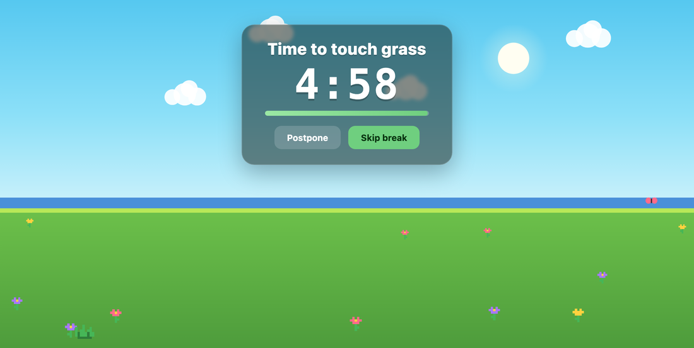

# 🌱 Touch Grass

A cozy VS Code break reminder. Every hour (or however often you like) it gently
takes over the editor with a calm pixel-art meadow and counts down a break so
you actually look away from the screen and rest your eyes.



## Features

- **Hourly break reminders** on a strict wall-clock timer (fully configurable).
- **A calm pixel-art break screen** that fills the editor: a grassy meadow with
  drifting clouds, flowers, and the odd butterfly. The palette follows your
  local time of day with a classic 16-bit RPG feel — dawn, day, sunset, dusk, and a
  starry night with a crescent moon.
- **Always in control:** **Skip** and **Postpone** are always on screen (and
  `Esc` skips). The break auto-closes when the countdown ends.
- **Status-bar countdown** to the next break. Click it for a quick menu:
  take a break now · postpone · reset the timer · pause/resume · settings.
- **Lots of knobs:** interval, break length, postpone length, auto-start,
  auto-end, and reduced motion.

No telemetry, no network, no runtime dependencies. The whole scene is drawn
procedurally on a canvas.

## Install

Not on the Marketplace — you build a `.vsix` once and install it. No account or
sign-in needed; [Node](https://nodejs.org) is required only for the one-time build
(it runs `vsce` via `npx`), never to run the extension.

**1. Get the code and build the `.vsix`:**

```bash
git clone https://github.com/mariotmc/touch-grass.git
cd touch-grass
npx @vscode/vsce package          # → touch-grass-0.1.0.vsix
```

**2. Install it into VS Code:**

```bash
code --install-extension touch-grass-0.1.0.vsix
```

Restart VS Code (or run **Developer: Reload Window**). The countdown appears in
the status bar and the first break fires on schedule — it auto-starts on every
launch.

Step 2 is the same command everywhere; the only difference is making sure the
`code` CLI is found:

- **Windows** — run the commands in PowerShell or Command Prompt. `code` is on
  `PATH` if you kept "Add to PATH" when installing VS Code (the default).
- **macOS** — if `code` isn't found, open the Command Palette (`Cmd+Shift+P`) →
  **Shell Command: Install 'code' command in PATH**, then retry.
- **WSL2 / Linux** — run both commands from the WSL/Linux shell, so the extension
  installs into that environment's VS Code **server**
  (`~/.vscode-server/extensions`) and loads in every window there. `code` is on
  `PATH` once you've opened a folder in VS Code from that shell at least once.

## Updating

Local installs don't auto-update (no Marketplace), so after you push changes you
pull them onto each machine yourself.

- **Symlink the repo (recommended — no rebuilding).** Install once by linking the
  repo into your extensions folder; after that, updating is just `git pull` +
  **Developer: Reload Window**, since VS Code loads the live files. No Node needed
  for this path.

  ```bash
  # macOS / Linux / WSL  (use ~/.vscode-server/extensions on WSL & SSH remotes)
  ln -s "$PWD" ~/.vscode/extensions/mariotmc.touch-grass-0.1.0
  ```

  Native Windows, in an elevated / Developer-Mode terminal:

  ```bat
  mklink /D "%USERPROFILE%\.vscode\extensions\mariotmc.touch-grass-0.1.0" "C:\path\to\touch-grass"
  ```

  Already installed the `.vsix`? Remove it first so the two don't clash:
  `code --uninstall-extension mariotmc.touch-grass`.

- **Or rebuild the `.vsix`.** Repeat the build and reinstall with `--force` — the
  version doesn't change on every push, so without it VS Code skips the reinstall:

  ```bash
  git pull && npx @vscode/vsce package && code --install-extension touch-grass-0.1.0.vsix --force
  ```

## Develop

To hack on it, run straight from source — **no build step, and no Node needed for
this path** (the editor provides the runtime; there are no runtime dependencies).

1. Open this folder in VS Code.
2. Press **F5** ("Run Touch Grass Extension", from
   [.vscode/launch.json](.vscode/launch.json)). A new **[Extension Development
   Host]** window opens with the extension loaded.
3. The countdown appears in the status bar; to trigger a break immediately, run
   **Touch Grass: Take a Break Now** from the Command Palette (`Cmd+Shift+P`).

After editing the code, press **`Cmd+R`** in the Extension Development Host window
to reload it with your changes.

> If F5 ever shows **"Configured debug type 'extensionHost' is not supported"**,
> the built-in **JavaScript Debugger** is disabled — enable it via the Extensions
> view (`Cmd+Shift+X`) → search `@disabled` → **JavaScript Debugger** → reload.

## Commands

All under the **Touch Grass:** category in the Command Palette.

| Command | What it does |
| --- | --- |
| Take a Break Now | Start a break immediately. |
| Postpone Break | Delay the current/next break by your postpone length. |
| Skip Break | End the current break and start the next interval. |
| Reset Interval Timer | Restart the countdown at the full interval. |
| Pause / Resume Reminders | Toggle the whole system on/off. |
| Open Menu | The quick menu (same as clicking the status bar). |

## Settings

Search **"Touch Grass"** in Settings. Defaults in parentheses.

| Setting | Default | Notes |
| --- | --- | --- |
| `touchGrass.enabled` | `true` | Master on/off switch. |
| `touchGrass.startAutomatically` | `true` | Start counting when VS Code loads. |
| `touchGrass.intervalMinutes` | `60` | Minutes of work between breaks. |
| `touchGrass.breakDurationSeconds` | `300` | Break length (5 min). |
| `touchGrass.postponeMinutes` | `5` | How long Postpone snoozes. |
| `touchGrass.autoEndBreak` | `true` | Auto-close the break at zero. |
| `touchGrass.maximizeOnBreak` | `true` | Maximize the editor + hide the side bar during a break, then restore. |
| `touchGrass.showStatusBar` | `true` | Show the countdown in the status bar. |
| `touchGrass.reducedMotion` | `false` | Calmer, slower animation. |
| `touchGrass.focusWindowOnBreak` | `true` | Get your attention when a break starts so you don't miss it — foregrounds VS Code (macOS), flashes the taskbar button (Windows/WSL), or shows a notification (Linux). Best-effort. |
| `touchGrass.syncAcrossWindows` | `true` | Share one break schedule across all open VS Code windows — a new window joins the current countdown, and breaks/postpones/skips sync. Pause stays per-window. |

## How it works

A 1 Hz ticker compares absolute timestamps (`nextBreakAt`, `breakEndsAt`)
against the wall clock, so the timer is drift-free and an overdue break fires
right after the machine wakes from sleep. When a break starts, a sandboxed
webview (strict CSP, per-load nonce) renders the meadow on a `<canvas>` and
reports Skip/Postpone/done back to the extension.

## The pixel art

The scene — sky, sun or crescent moon, clouds, water-band horizon, grass,
flowers, butterflies — is original and drawn procedurally on a canvas by
[media/break.js](media/break.js), with one palette per time-of-day band
(dawn / day / sunset / dusk / starry night). The little plants are small pixel
char-grids in [media/sprites.js](media/sprites.js).

## Known limitations

- **Multiple windows** share one break schedule by default
  (`syncAcrossWindows`), so they break together; pause is per-window. Turn the
  setting off to give each window its own independent timer.
- VS Code can't lock the OS, so the "takeover" is a focused, maximized,
  dismissible editor tab — not a hard screen lock.

## License

MIT — see [LICENSE](LICENSE).
